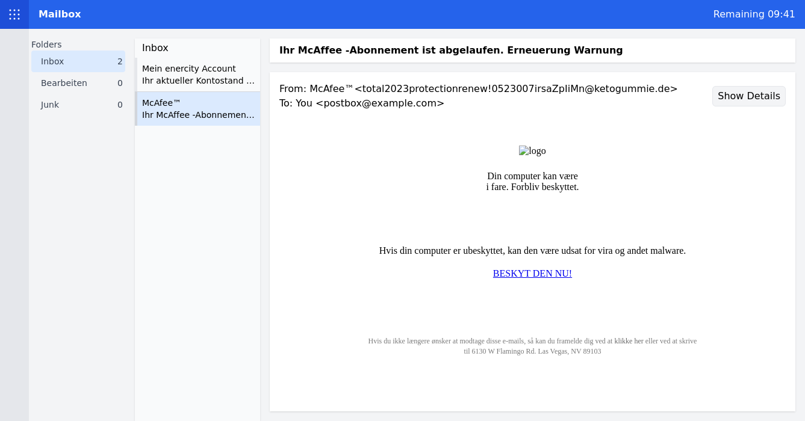
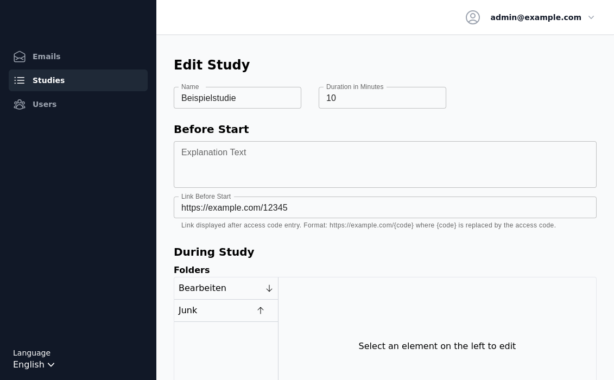

[](https://choosealicense.com/licenses/mit/)
# Phishy Mailbox

Phishy Mailbox is a tool for researching human factors of phishing. It was created for researchers to easily run phishing studies using real emails in an in-basket exercise, where participants categorize the emails into a number of configurable folders.

## Screenshots


Participant interface, showcasing a user-friendly design to categorize emails.

<br/><br/>


Researcher's dashboard allowing the easy setup and management of phishing studies.

In depth documentation is available in both [english](documentation/documentation_english.pdf) and [german](documentation/dokumentation_deutsch.pdf).

## Easy Installation 

1. Install [Docker](https://www.docker.com/) on your machine. For Windows, Docker Desktop is recommended. Keep in mind you need admin privileges to execute Docker.
2. Download the docker-compose.yml from this repository and place it into an empty folder.
3. Download the docker image from [Dockerhub](https://hub.docker.com/r/thorstenthiel/phishy-mailbox) into the same folder.
4. Start docker, if necessary.
5. Start the command line interface and navigate to the folder containing image and yml file.
6. type in: docker compose up -d
7. Wait for the program to load

The application should start and be reachable from localhost:3000 (user interface) or localhost:3000/admin. 

## Citation

If you use this software for your research, please don't forget to cite it in your papers! Link to the publication: [https://www.ndss-symposium.org/wp-content/uploads/usec25-37.pdf](https://www.ndss-symposium.org/wp-content/uploads/usec25-37.pdf)

## Origin

The first version of this tool was created in the context of a bachelor's thesis at the [department for usable security and privacy](https://www.itsec.uni-hannover.de/de/usec) at Leibniz Universität Hannover.

## Contributing

We welcome contributions from the community. Feel free to open issues and submit pull requests.

## Run locally

Prerequisites: [Docker](https://www.docker.com/) and [Yarn](https://yarnpkg.com/)

The application consists of two components. The first one is a PostgreSQL database that can be launched after installing docker via running `docker compose up -d` in the root directory.

Afterwards you can run the following commands to start the Next.js server that serves both the spa-frontend as well as the backend API using prisma as the ORM.

```bash
yarn
yarn prisma generate
yarn prisma db push
yarn node ./prisma/seed.js
yarn dev
```

## Deployment

The same two components used for development are also required for deployment, general instructions to deploy a next.js application are available [here](https://nextjs.org/docs/pages/building-your-application/deploying).
During development a deployment using [Vercel](https://vercel.com/) and [supabase](https://supabase.com/) was tested and can be recommended.

## Testing

Currently there is a single test that performs a smoke test of the particpants view by executing a small study.
To run the test you need to have the application running locally, have seeded the database using the seed script.
Then you can run the test using the following command: (If not done before it may be necessary to install a browser, the command will tell you if that is the case)

```bash
yarn playwright test
```
