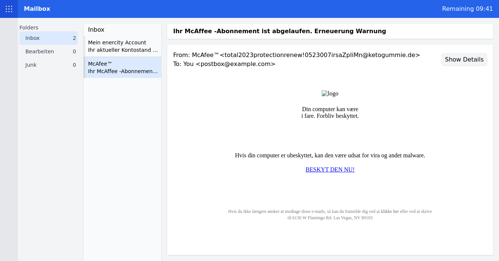
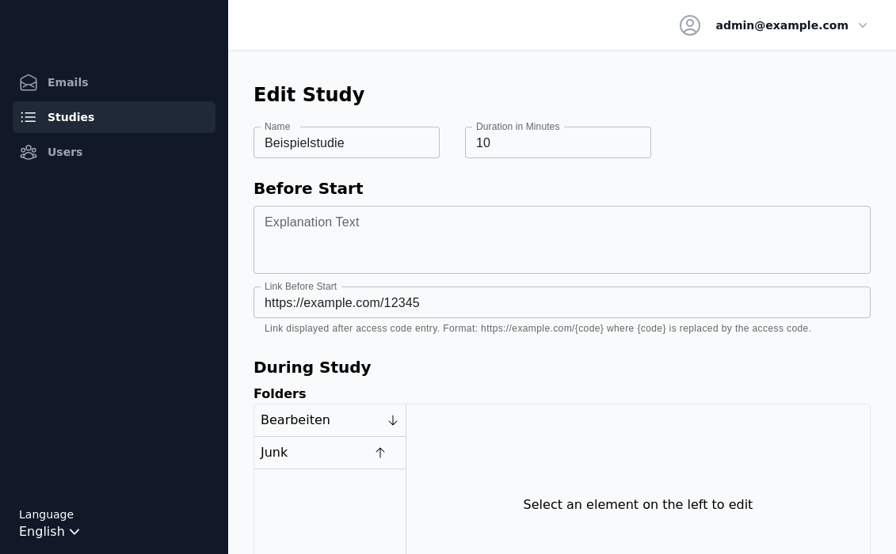

[](https://choosealicense.com/licenses/mit/)
# Phishy Mailbox

Phishy Mailbox is a tool for researching human factors of phishing. It was created for researchers to easily run phishing studies using real emails in an in-basket exercise, where participants categorize the emails into a number of configurable folders.

## Screenshots


Participant interface, showcasing a user-friendly design to categorize emails.

<br/><br/>


Researcher's dashboard allowing the easy setup and management of phishing studies.

In depth documentation is available in both [english](documentation/documentation_english.pdf) and [german](documentation/dokumentation_deutsch.pdf).

## Easy Installation 

1. Install [Docker](https://www.docker.com/) on your machine. For Windows, Docker Desktop is recommended. Keep in mind you need admin privileges to execute Docker.
2. Download the docker-compose.yml from this repository and place it into an empty folder.
3. Download the docker image from [Dockerhub](https://hub.docker.com/r/thorstenthiel/phishy-mailbox) into the same folder.
4. Start docker, if necessary.
5. Start the command line interface and navigate to the folder containing image and yml file.
6. type in: docker compose up -d
7. Wait for the program to load

The application should start and be reachable from localhost:3000 (user interface) or localhost:3000/admin. 

## Citation

If you use this software for your research, please don't forget to cite it in your papers! Link to the publication: [https://www.ndss-symposium.org/wp-content/uploads/usec25-37.pdf](https://www.ndss-symposium.org/wp-content/uploads/usec25-37.pdf)

## Origin

The first version of this tool was created in the context of a bachelor's thesis at the [department for usable security and privacy](https://www.itsec.uni-hannover.de/de/usec) at Leibniz Universität Hannover.

## Contributing

We welcome contributions from the community. Feel free to open issues and submit pull requests.

## Run locally

Prerequisites: [Docker](https://www.docker.com/) and [Yarn](https://yarnpkg.com/)

The application consists of two components. The first one is a PostgreSQL database that can be launched after installing docker via running `docker compose -f docker-compose.dev.yml up -d` in the root directory.

Afterwards you can run the following commands to start the Next.js server that serves both the spa-frontend as well as the backend API using prisma as the ORM.

```bash
yarn
yarn prisma generate
yarn prisma db push
yarn node ./prisma/seed.mjs
yarn dev
```

## Deployment

The same two components used for development are also required for deployment, general instructions to deploy a next.js application are available [here](https://nextjs.org/docs/pages/building-your-application/deploying).
During development a deployment using [Vercel](https://vercel.com/) and [supabase](https://supabase.com/) was tested and can be recommended.

When upgrading an existing deployment across a PostgreSQL major version (e.g. the move from 15 to 17), the bundled database needs a dump & restore — see [UPGRADING.md](UPGRADING.md).

## Testing

The test suite is split into two layers, both running against a **dedicated test
database** (PostgreSQL on port `5434`, separate from the dev DB on `5432`). Start it
once with:

```bash
yarn test:db:up     # docker-compose.test.yml, Postgres on :5434
# ... run tests ...
yarn test:db:down   # stop and remove it
```

### Integration tests (Vitest) — primary coverage

These call the tRPC routers directly (`appRouter.createCaller`) against the test DB.
Every test runs inside its **own transaction that is rolled back afterwards**, so
nothing is ever committed — tests are completely isolated and parallel-safe (each
Vitest worker uses its own connection). This is the reliable coverage metric to
iterate on.

```bash
yarn test:unit          # run once
yarn test:unit:watch    # watch mode
yarn test:coverage      # with coverage -> coverage/unit/index.html
```

Tests live next to the code as `src/**/*.test.ts`; shared helpers/factories are in
`test/integration/`.

### End-to-end tests (Playwright)

Browser tests of the real user flows. For complete isolation with parallelism, **each
Playwright worker boots its own Next.js server on its own port and clones its own
database** from a migrated template; before every test the worker DB is truncated and
re-seeded (clean slate). The first run performs a `next build`.

```bash
yarn test:e2e                       # build + run (2 workers by default)
PLAYWRIGHT_WORKERS=4 yarn test:e2e  # more parallelism (one server/DB per worker)
SKIP_BUILD=1 yarn test:e2e          # reuse an existing .next build
```

Specs and fixtures live in `test/e2e/`.

### A note on coverage

Coverage is measured at the **integration layer** (`yarn test:coverage`), which maps
cleanly and reliably to `src/server/**`. The way to raise coverage is to add more
integration tests there. The e2e suite intentionally does **not** produce a coverage
number: it runs against the compiled Next.js production server, whose V8 coverage does
not map back to source without server source maps, so any figure would be misleading.
E2E tests exist to verify the real user flows end to end, not to move a coverage gauge.
